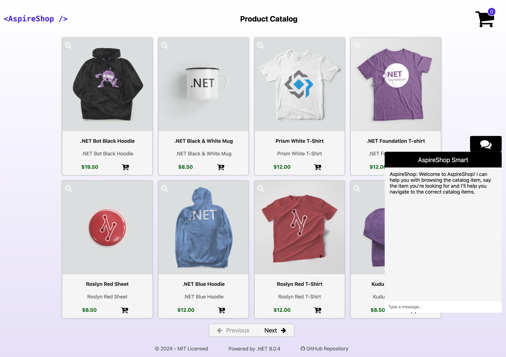
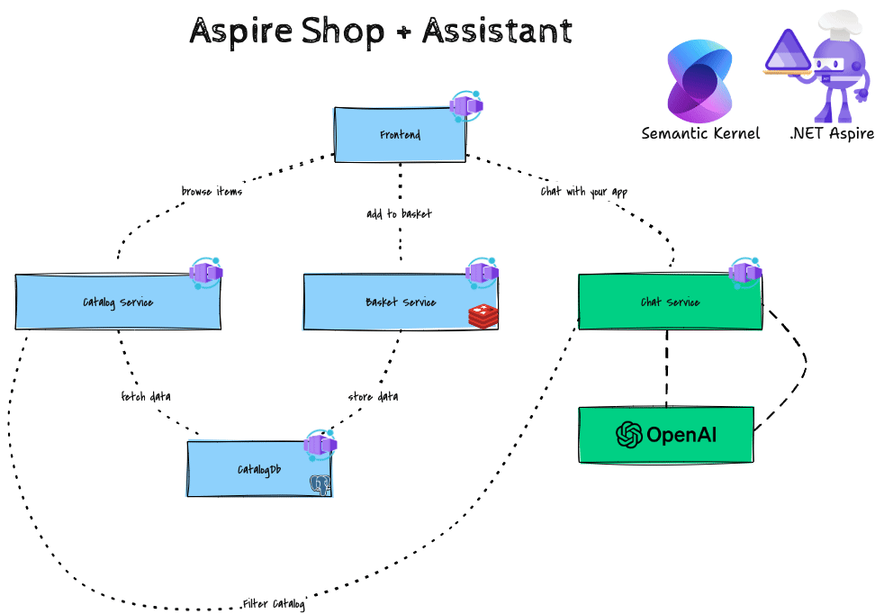

---
languages:
- csharp
products:
- dotnet
- dotnet-aspire
- semantic-kernel
page_type: sample
name: ".NET Aspire Shop and Semantic Kernel sample"
urlFragment: "AspireShopWithSK"
description: "An example shop app with assistant written with .NET Aspire and Semantic Kernel"
---

# 🤖 Aspire Shop with Semantic Kernel 🔋



This project is a modified version of the [Aspire Shop](https://github.com/dotnet/aspire) sample with the addition of an intelligent assistant powered by [Semantic Kernel](https://github.com/microsoft/semantic-kernel). The assistant is available in the form of a chat service that can be accessed from the web front end.


The app consists of four services:

- **AspireShop.Frontend**: This is a Blazor app that displays a paginated catlog of products and allows users to add products to a shopping cart.
- **AspireShop.CatalogService**: This is an HTTP API that provides access to the catalog of products stored in a PostgreSQL database.
- **AspireShop.CatalogDbManager**: This is an HTTP API that manages the initialization and updating of the catalog database.
- **AspireShop.BasketService**: This is a gRPC service that provides access to the shopping cart stored in Redis.
- **NEW! AspireShop.ChatService**: This is an HTTP API that provides an intelligent assistant to help users with their shopping experience. 

The app also includes a class library project, **AspireShop.ServiceDefaults**, that contains the service defaults used by the service projects.

## Pre-requisites

- [.NET 8 SDK](https://dotnet.microsoft.com/download/dotnet/8.0)
- [Semantic Kernel](https://github.com/microsoft/semantic-kernel)
- [Docker Desktop](https://www.docker.com/products/docker-desktop/)
- **Optional** [Visual Studio 2022 17.9 Preview](https://visualstudio.microsoft.com/vs/preview/)

## Running the app locally

Edit the `appsettings.Development.json` file in the `AspireShop.AppHost` project to point to the correct values as follows:

### Azure OpenAI    
When using Azure OpenAI, use and update these values:
```json
"Parameters" : {
  "ChatDeploymentName": "Replace this with your Azure OpenAI Chat Deployment",
  "ChatEndpoint": "Replace this with your Azure OpenAI Endpoint",
  "ChatApiKey": "Replace this with your Azure OpenAI or OpenAI Api Key"
}
```

### OpenAI
When using OpenAI, use and update these values:
```json
"Parameters" : {
  "ChatApiKey": "Replace this with your OpenAI Api Key",
  "ChatModelId": "Replace this with your OpenAI Model Id"
}
```

If using Visual Studio, open the solution file `AspireShop.sln` and launch/debug the `AspireShop.AppHost` project.

If using the .NET CLI, run `dotnet run` from the `AspireShop.AppHost` directory.

Alternatively, you can use devcontainer to run and debug the app via a container. Open the project in Visual Studio Code and select `Reopen in Container` from the context menu.

Consult your IDE/Text Editor documentation for more information on how to run the app using devcontainer.

## Deploy to Azure

To deploy the app to Azure, you can use one of the following options:
1. [Azure Developer CLI](#azure-developer-cli)
2. [GitHub Actions](#github-actions)

### Azure Developer CLI
> [!NOTE]
> This section will create Azure resources and deploy the solution from your local environment using the Azure Developer CLI. Note that you do not need to clone this repo to complete these steps.

```pwsh
azd init -t vicperdana/AspireShopWithSK
azd up

# if you are wanting to see logs run with debug
azd up --debug
```

### GitHub Actions

> [!IMPORTANT]
> This section is work in progress 🚧.


> [!NOTE]
> This section will create Azure resources and deploy the solution from your GitHub repository using GitHub Actions. Note that you need to fork this repo to complete these steps.

1. Fork this repository.
2. Run the following commands
```pwsh
cd /your/repo/path
azd init 
```
The following prompt will appear:
```pwsh
Initializing an app to run on Azure (azd init)

? Enter a new environment name: [? for help]

# Select Use code in the current directory when azd prompts you with two app initialization options.
? How do you want to initialize your app?  [Use arrows to move, type to filter]
> Use code in the current directory
  Select a template
```

Select the Confirm and continue initializing my app option.
```pwsh
Detected services:

  .NET (Aspire)
  Detected in: D:\source\repos\AspireSample\AspireSample.AppHost\AspireSample.AppHost.csproj

azd will generate the files necessary to host your app on Azure using Azure Container Apps.

? Select an option  [Use arrows to move, type to filter]
> Confirm and continue initializing my app
  Cancel and exit
  
Generating files to run your app on Azure:

  (✓) Done: Generating ./azure.yaml
  (✓) Done: Generating ./next-steps.md

SUCCESS: Your app is ready for the cloud!
You can provision and deploy your app to Azure by running the azd up command in this directory. For more information on configuring your app, see ./next-steps.md
```

3. Create the GitHub pipeline
Run this command to configure your deployment pipeline and securely connect it to Azure and provide secret parameters. 
```pwsh
>> azd pipeline config
? Select an Azure Subscription to use: 
? Select an Azure location to use:  
? Enter a value for the 'chatApiKey' infrastructure secured parameter: ********************************
? Enter a value for the 'chatDeploymentName' infrastructure secured parameter: *****
? Enter a value for the 'chatEndpoint' infrastructure secured parameter: *************************************

Configure your GitHub pipeline

  (✓) Done: Checking current directory for Git repository
  (✓) Done: Creating service principal xxx (xxxxxx-xxxx-xxxx-xxxx-xxxxxxxxxxx)
  (✓) Done: Federated identity credential for GitHub: subject repo:owner/AspireShopWithSK:pull_request
  (✓) Done: Federated identity credential for GitHub: subject repo:owner/AspireShopWithSK:ref:refs/heads/main
  (✓) Done: Setting AZURE_ENV_NAME repo variable
  (✓) Done: Setting AZURE_LOCATION repo variable
  (✓) Done: Setting AZURE_SUBSCRIPTION_ID repo variable
  (✓) Done: Setting AZURE_TENANT_ID repo variable
  (✓) Done: Setting AZURE_CLIENT_ID repo variable

  GitHub Action secrets are now configured. You can view GitHub action secrets that were created at this link:
  https://github.com/vicperdana/AspireShopWithSK/settings/secrets/actions

? Would you like to commit and push your local changes to start the configured CI pipeline? (Y/n) Y

(✓) Done: Pushing changes
(✓) Done: Queuing pipeline

SUCCESS: Your GitHub pipeline has been configured!
```


## Further info
See the presentation [slides](./assets/Reactor.pdf) and the video below for more information on the project.
[](https://www.youtube.com/watch?v=7xOAc_twiAQ)

## License
This project is licensed under the MIT License - see the [LICENSE](LICENSE) file for details.

## Acknowledgements
This project uses the [Aspire Shop](https://github.com/dotnet/aspire-samples/tree/main/samples/AspireShop) sample as the basis. Additionally, the following resources were used as references:
- [Semantic Kernel](https://github.com/microsoft/semantic-kernel)
- [Semantic Kernel DevBlogs Dependency Injection](https://devblogs.microsoft.com/semantic-kernel/using-semantic-kernel-with-dependency-injection/)
- [.NET Aspire Discussions](https://github.com/dotnet/aspire/discussions)
- [Semantic Kernel Discord](https://aka.ms/SKDiscord)
